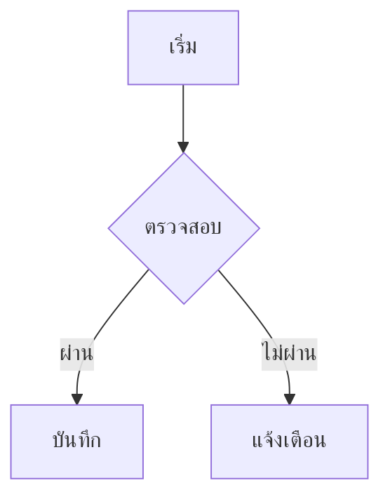

# หัวข้อระดับหนึ่ง

ย่อหน้าธรรมดา มี **ตัวหนา** และ *ตัวเอียง* กับ `inline code` และ [ลิงก์](https://example.com) ปนกันอยู่ในประโยคเดียว

## หัวข้อระดับสอง

### หัวข้อระดับสาม

รายการแบบไม่เรียงลำดับ:

- ข้อแรก
- ข้อสอง มีข้อความยาวพอสมควรเพื่อดูว่าตัดบรรทัดแล้วย่อหน้าตรงกันไหม
- ข้อสาม

รายการแบบเรียงลำดับ:

1. ขั้นตอนที่หนึ่ง
2. ขั้นตอนที่สอง
3. ขั้นตอนที่สาม

> นี่คือ blockquote ธรรมดา ควรเห็นเป็นกล่องหรือมีเส้นด้านซ้าย

> [!NOTE]
> กล่องหมายเหตุแบบ GitHub

> [!WARNING]
> กล่องข้อควรระวัง

ตารางข้อมูล:

| คอลัมน์ A | คอลัมน์ B | ค่า |
| --- | --- | --- |
| แถวหนึ่ง | ข้อมูล | 123 |
| แถวสอง | ข้อมูลยาวกว่า | 4567 |
| แถวสาม | สั้น | 8 |

โค้ดบล็อก:

```python
def hello(name):
    print(f"สวัสดี {name}")
    return len(name)
```

---

สูตรคณิต inline $a^2 + b^2 = c^2$ และแบบแยกบรรทัด:

$$ \int_0^\infty e^{-x^2}\,dx = \frac{\sqrt{\pi}}{2} $$

แผนภาพ:



รูปภาพในเครื่อง:


ย่อหน้าสุดท้ายเพื่อปิดบท
