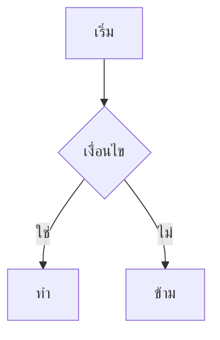
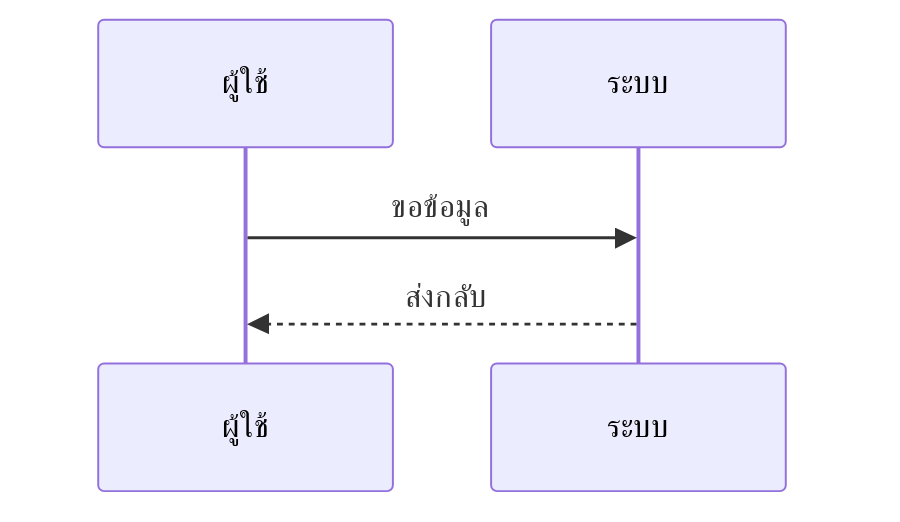
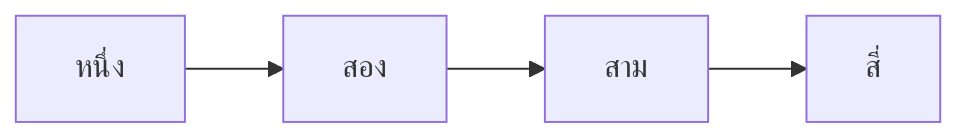

# บทที่มีแผนภาพหลายอัน

แผนภาพที่หนึ่ง:

```mermaid
flowchart LR
  A[อินพุต] --> B[ประมวลผล] --> C[เอาต์พุต]
```

แผนภาพที่สอง:

```mermaid
flowchart TD
  X[เริ่ม] --> Y{เงื่อนไข}
  Y -->|ใช่| Z[ทำ]
  Y -->|ไม่| W[ข้าม]
```

แผนภาพที่สาม:

```mermaid
sequenceDiagram
  ผู้ใช้->>ระบบ: ขอข้อมูล
  ระบบ-->>ผู้ใช้: ส่งกลับ
```

แผนภาพที่สี่:

```mermaid
flowchart LR
  P[หนึ่ง] --> Q[สอง] --> R[สาม] --> S[สี่]
```

จบบท
